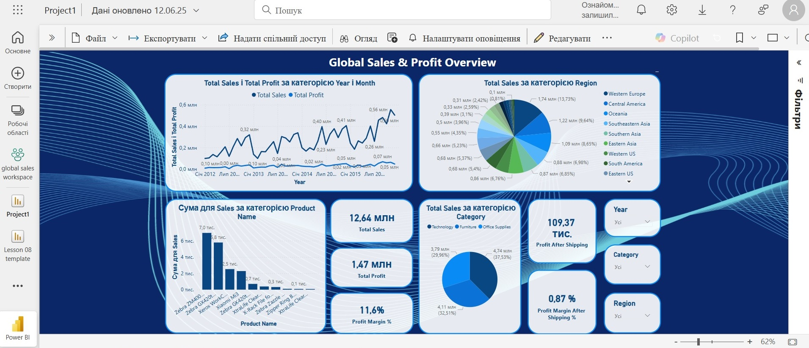

# 📊 Sales and Profit Analysis – Power BI Project

## 🧾 Overview

This Power BI project presents a comprehensive analysis of global sales, discounts, profit dynamics, and regional performance. It highlights how discounting strategies and delivery costs influence overall profitability.

---

## 🧠 Key Insights

- At first glance, the business appears profitable. However, a deeper look reveals that **shipping costs are borne by the seller**, and they significantly reduce net profit.
- **Some regions operate at a loss**, especially where large discounts are applied. These losses are likely tied to **market penetration strategies**.
- In **2012**, losses were at their peak. Over time, they gradually decreased, showing signs of **strategic improvement** and suggesting that these regions may become profitable in the future.

---

## 📂 Dashboard Pages

### 1. Global Sales & Profit Overview
- Year-over-year sales and profit trends  
- Sales by product, category, and region  
- Profit margin and performance summary

---

### 2. Discount Impact Analysis
- Relationship between discount groups and key metrics: quantity, sales, and profit after shipping  
- Shows how increasing discounts can impact profitability

---

### 3. Monthly Performance Analysis (YoY Trends)
- Detailed breakdown of sales, costs, and profits per month  
- Includes year-over-year (YoY) comparisons by % for every metric

---

### 4. Regional Performance – Revenue, Profit & Strategy Insight
- Comparison of regional sales vs. profit  
- Identifies which regions generate losses or operate near break-even  
- Helpful for strategic decision-making

---

## 🛠️ Tools Used

- Power BI (DAX, Visualizations)  
- Google Sheets (data source)  
- GitHub (documentation)

---

## 📁 Project File

📎 Download the Power BI project file here:  
[`Sales&Profit_Analysis.pbix`](./Sales&Profit_Analysis.pbix)

---

## 👩‍💻 Author

**Olena Avramenko**  
Junior Data Analyst | Power BI | SQL | Tableau  
[🔗 LinkedIn Profile](https://www.linkedin.com/in/o-avramenko/)
